Le mutation testing a été inventé en 1971 par Richard Lipton.
Sa réflexion est venue suite à des expériences de projets où les programmeurs devaient consacrer le moins de temps possible aux tests.
Le programmeur devait se contenter de tester intelligemment à moindre coût.
Pour lui, l'avantage des programmeurs est qu’ils créent des programmes qui sont presque corrects.
Les erreurs sont principalement dues à des actions inappropriées ou manquantes dans les spécifications. 
Ces erreurs devraient être détectables comme des déviations du programme prévu d’où le mutation testing.

Cette technique a pour but d’évaluer l’efficacité des tests unitaires des applications.

Son expansion a, en grande partie, été restreinte à cause de la lourdeur du processus,
mais l’augmentation de la puissance des machines permet de rendre le “mutation testing” plus accessible.

<!--END_SUMMARY-->

## Concept

Dans la plupart des projets actuels, les équipes mettent un taux minimal arbitraire de couverture du code à 70 ou 80% (en fonction de la maturité des équipes).

Cet indicateur ne veut pas dire que le code a été testé à 70 ou 80% et même une couverture de code à 100% n'exclut pas de trouver un bug même si cela peut apporter une illusion de sécurité : qui n’a jamais vu un test avec un assert(true).

En parallèle, dans les projets informatiques, plus un bug est découvert tard, plus il coûte cher, le mutation testing peut aider à réduire ces coûts.

Le concept du mutation testing est là pour venir modifier le code “métier” et ainsi vérifier si les tests unitaires arrivent à détecter les changements. 

Les objectifs du mutation testing sont multiples : 

* Identifier des tests qui ne détectent pas les changements
* Avoir un score de mutation
* Apprendre et analyser l'état d'infection d’une application.

## Vocabulaire du mutation testing

Les tests unitaires sont une composante du mutation testing. 
Le test unitaire correspond à la vérification d’un bon comportement d’une petite partie d’une application.

Une mutation est, quant à elle, une modification du code source, comme par exemple, l’action de remplacer un opérateur par un autre, voici quelques exemples : 

* passer de + à  -
* passer de >= à  ==
* passer de true à false
* supprimer une instruction

Un mutant est le code source modifié par une mutation

## Principe de mutation

Le principe de mutation se base sur un code “métier” sur lequel on souhaite tester la pertinence des tests unitaires.

Exemple de mutations possibles et de code métier associés

* `+` → `-`
* `-` → `+`
* `!=` → `==`
* `=` → `!=`
* `==` → `>=`


La phase de génération consiste à parcourir le code métier et à déterminer les mutations possibles. Dès qu’une mutation est applicable alors elle générera un nouveau “mutant”.

Le processus de génération des mutants peut être gourmand en ressources car le nombre de mutants peut varier en fonction de la complexité du code métier (il y a quelques années c’était encore un frein à l’utilisation de ce concept). 
Il existe des frameworks permettant de générer des mutants de façon “automatique” tel que Pitest pour Java.

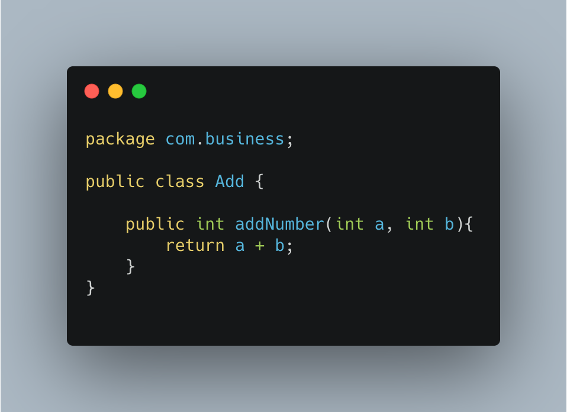

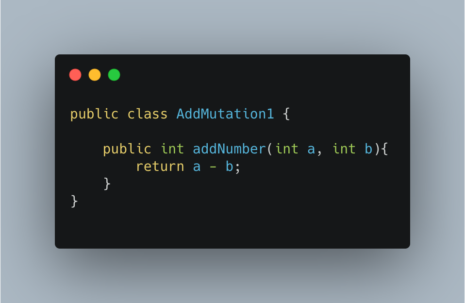

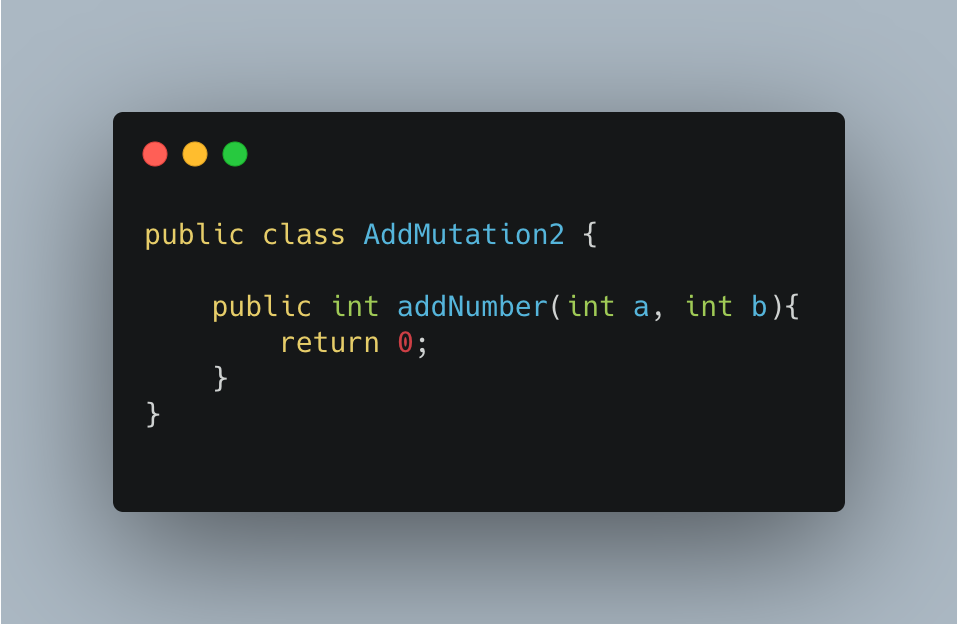

## Processus de tests

En reprenant l’exemple précédent, nous avons une classe qui a pour but de faire l’addition de deux nombres. Pitest a été utilisé pour le projet.
Pour l’exercice, nous allons voir plusieurs cas.

### Cas 1 : absence de test unitaire

Le but de ce test est de voir comment le mutation testing peut aider un projet sans test unitaire même si cela peut paraître une hérésie… c’est possible…

Voici le résultat de Pitest sur notre classe : 

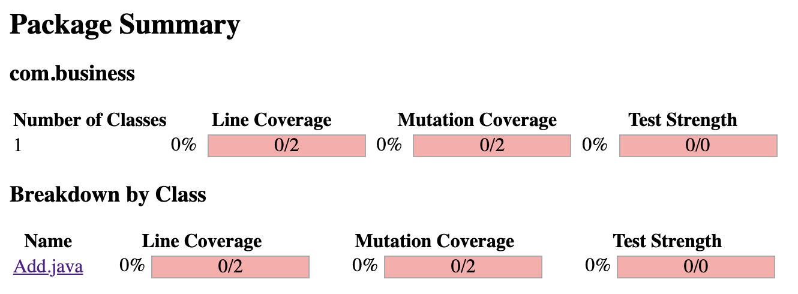

Pitest a créé deux mutants (mis en exemple précédemment) qui sont toujours en vie à la fin du test. Voici le détail des mutations qui ont été effectuées : 

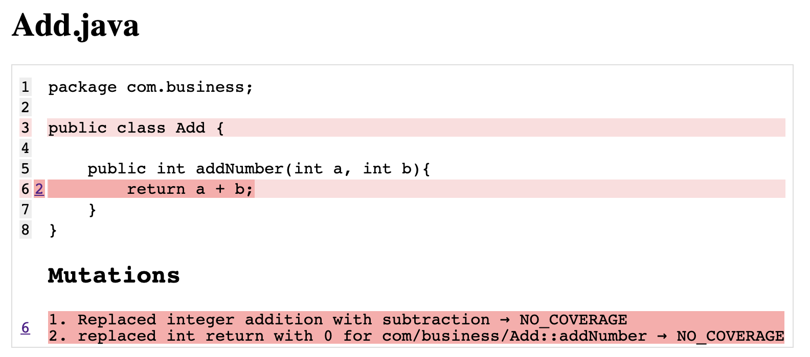

### Cas 2 : ajout d’un test unitaire 

Pour l’exemple, nous avons un test unitaire qui ne couvre pas entièrement la méthode testée.

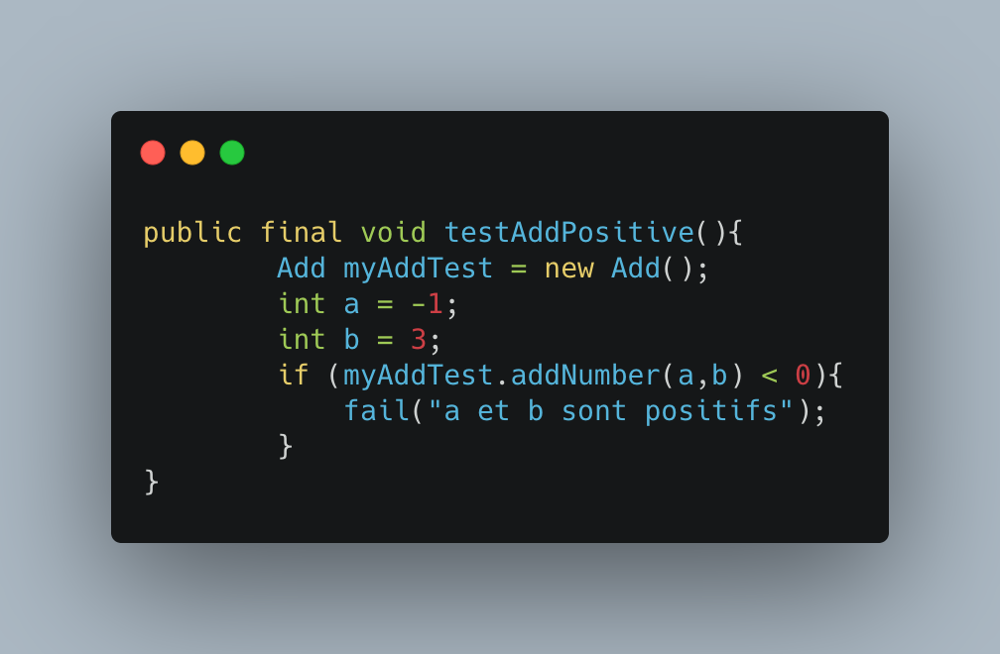

Le résultat du mutation testing est le suivant : 

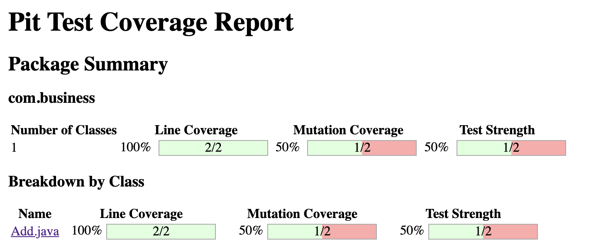

Le mutation testing révèle que les tests unitaires ne sont pas suffisamment costaud. Il faut les renforcer.

Le mutant encore debout est :


Pour cela, il faut analyser le rapport que Pitest donne et appliquer un correctif sur le test unitaire pour tuer le mutant au prochain lancement de Pitest.

## Cas 3 : renforcement du test unitaire 

Suite au renfort du test unitaire, Pitest indique que les tests sont bons et que tous les mutants ont été tués.

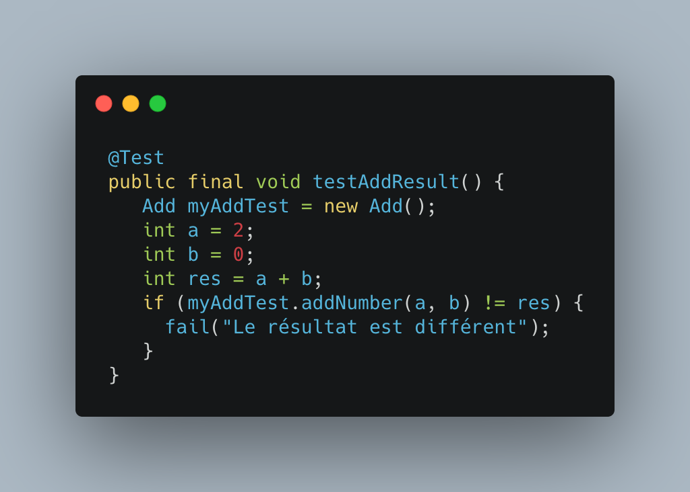

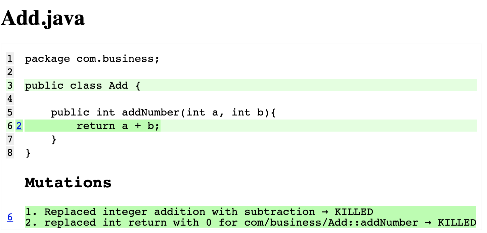

Sur un code court et très simple, Pitest a mis moins de 3s (en moyenne) pour générer des mutants et tester ces derniers.
Il a permis de remonter des faiblesses dans les tests unitaires.
Le travail d’analyse sur les mutants encore en vie est assez simple pour ce cas.

Afin de connaître les limites du mutation testing nous allons l’utiliser sur du code plus complexe.

Schéma d’explication du framework :

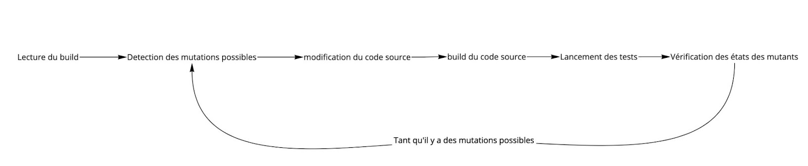

## Exemple avec le périmètre d’un rectangle

Le but de ce programme est de calculer l’aire d’un rectangle.

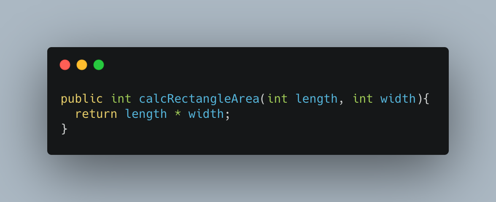

On se doit de vérifier si l’aire du rectangle n’est pas égale à 0.

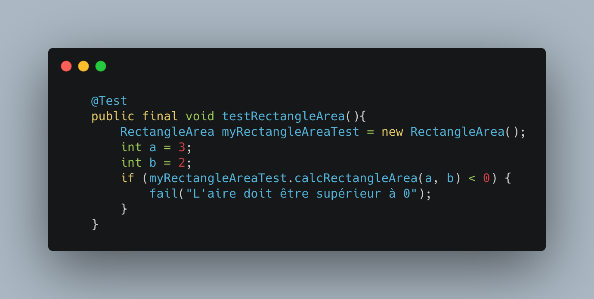

Une interprétation supplémentaire peut être apportée au code : “Un carré n’est pas un rectangle”.

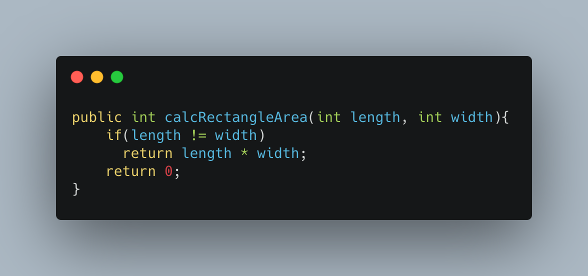

Suite au changement de code un test est ajouté afin de tester un carré dont les côtés valent 0.

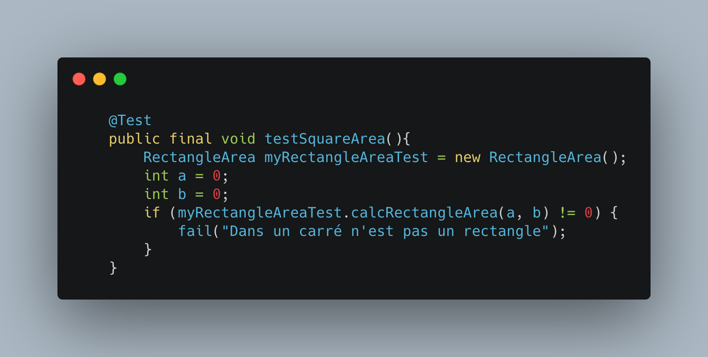

Dans les deux cas, Pitest remonte une couverture sur le mutation testing de 0%.

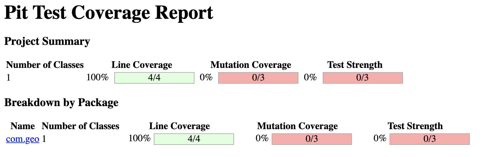
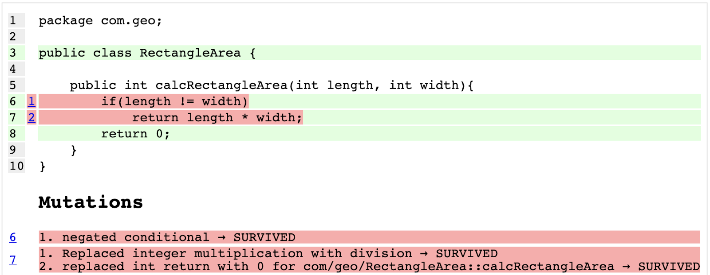

Voici les mutants survivants créés par Pitest. 
Il faut donc analyser les problèmes et renforcer les tests unitaires. 
L’analyse en fonction des résultats peut prendre du temps.

## Exemple avec une application plus complexe

### Spring PetClinic

Spring PetClinic est une application exemple proposée par Spring. Elle montre les principales fonctionnalités du framework. C’est une application simple qui compte environ 250 lignes de code.

Elle propose des tests JUnit 5 avec quelques tests unitaires mais surtout des tests d’intégration, dont certains avec des mocks. Au total une quarantaine de tests et une couverture de 93%

L’exécution de l’ensemble des tests prend environ dix secondes dans un IDE.
La commande `mvn test` s’exécute approximativement en 20 secondes.

On peut exécuter pitest sur un projet Maven en tapant directement la commande : `mvn org.pitest:pitest-maven:mutationCoverage`

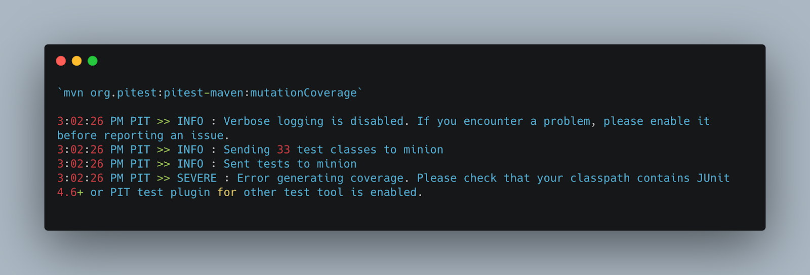

Il est nécessaire d’intégrer un plugin pour le support de Junit 5 (par défaut, PiTest ne supporte que JUnit 4). Le message n’est d’ailleurs pas très précis.
Cela impose (malheureusement) de modifier le pom.xml pour y rajouter PiTest

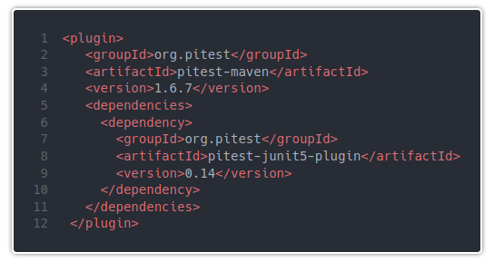


```
================================================================================
- Statistics
================================================================================
>> Line Coverage: 222/238 (93%)
>> Generated 111 mutations Killed 74 (67%)
>> Mutations with no coverage 8. Test strength 72%
>> Ran 235 tests (2.12 tests per mutation)
```

Le temps d’exécution est d’un peu plus de 2 minutes.

## Quel indicateur mutation testing ?

Pitest fournit un taux de force par rapport au mutation testing. 

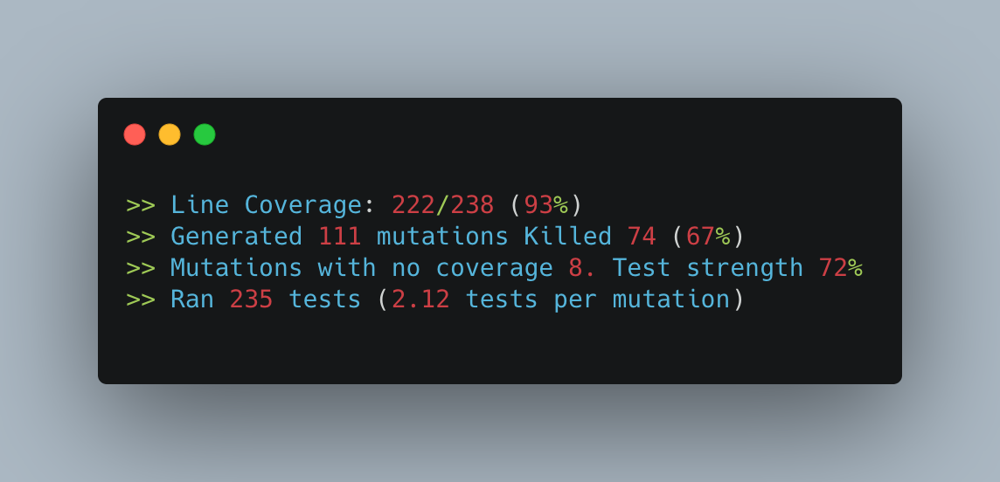

Ce taux peut être utilisé avec le % de couverture de code dans les équipes comme indicateur de qualité sur les premiers niveaux de tests.

## Implémentations possibles sur différents langages

Il existe différents outils pour faire du mutation testing selon les langages : 

Java → Pitest

Kotlin → Pitest

Scala → Stryker

PHP → Infection

JS → Stryker

TypeScript → Stryker

Python → MutPy

## Où situer le mutation testing dans les méthodes BDD et TDD ?

Le Mutation testing est un complément à ces méthodes, il permet de couvrir l’ensemble des tests unitaires et du code en apportant des modifications.

Le TDD aide à garder le code modulaire cependant il ne suffit pas à fournir un code qui fonctionne exactement comme prévu car il est toujours possible d’ajouter du code à une partie de l’application sans en décrire les attentes. Ceci peut mettre en danger l’ensemble du code. Le mutation testing permet de détecter de façon régulière les possibles “brèches” dans le développement.

Le BDD, quant à lui, est là pour décrire le comportement que doit avoir une application. Le mutation testing lui va s’assurer du bon fonctionnement d’une fonction et non du comportement global.

## Limites sur le mutation testing 

L’une des premières limites du mutation testing portait sur l’impact qu’il avait sur les ressources d’un ordinateur (CPU/RAM). Cette limite est de moins en moins vrai aujourd’hui.

La seconde limite reste le temps d’analyse qu’il y a après un rapport de test de mutation testing. Il faut analyser le rapport, puis corriger le test unitaire et ensuite relancer le test de mutation.
Dans cette analyse on peut se retrouver avec des faux positifs ce qui peut constituer une “perte de temps”.

La troisième limite est une tendance de plus en plus présente de nos jours : celle du Green IT.
Le Green IT est une démarche d’amélioration continue qui vise à réduire l’empreinte écologique, économique et sociale des technologies de l’information et de la communication et de l’organisation grâce aux outils numériques. Le mutation testing est très gourmand en termes de ressources CPU et RAM vu qu’il lit le projet, crée des mutants à partir du code source, recompile et rejoue les tests autant de fois qu’il y a de mutants disponibles.


En conclusion, le mutation testing est un outil qui aide les équipes à améliorer la qualité de leurs tests unitaires. Cependant cette méthode peut se révéler très coûteuse si on souhaite une couverture à 100%. 
Il faut prendre en compte le temps d’analyse du rapport et du code à la génération des mutants et à l'exécution des tests pour chaque mutant. 
Cet outil doit être utilisé dans des équipes qui sont déjà “matures” sur la qualité de leur tests. Il peut aider les nouveaux développeurs à structurer leur façon de construire les TU.
De plus, il est possible d’utiliser cet outil pour cibler uniquement des parties bien précises de l’application, notamment les parties les plus sensibles, cela peut être un bon moyen de réduire les coûts et de se concentrer sur le plus critique.

## Quelques axes de réflexion pour aller plus loin sur ce sujet
Comment intégrer le mutation testing dans une stratégie de test ?
Comment automatiser les tests de mutation testing avec github lors d’une peer review par exemple ?
Peut-on automatiser la lecture des rapports et en ressortir les problèmes les plus critiques ?

## Ressources / Bibliographie :

* Papier de Google : https://research.google/pubs/pub46584/ State of Mutation Testing at Google (PDF)

Ce papier décrit comment Google utilise les tests de mutation dans le process de code review, pour maximiser la pertinence des mutants :
une mutation max par ligne de code étudiée (pour limiter la complexité de la review)
le code “aride” n’est pas muté (caches, System.out.println, code de logging => if debug, log.debug() ))
les mutations qui rendraient le code équivalent (supprimer un cache/memoization, for i < 10 ou for i != 10) ne sont pas testées
ils ne testent pas non plus les mutations sur le code qui pourrait être généré (equals/hashCode/toString) et les messages d’exceptions

* Blog de PiTest : https://blog.pitest.org/  

* PiTest : https://pitest.org/ 

* https://github.com/theofidry/awesome-mutation-testing Hints on Test Data Selection: Help for the Practicing Programmer de Richard A. Demillo et R.J Lipton


