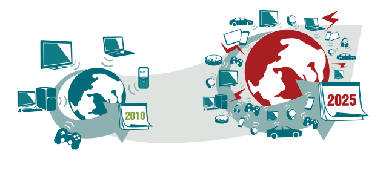
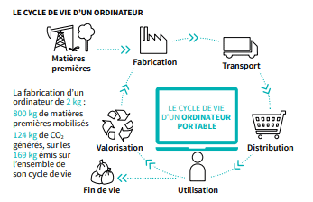
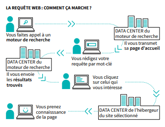
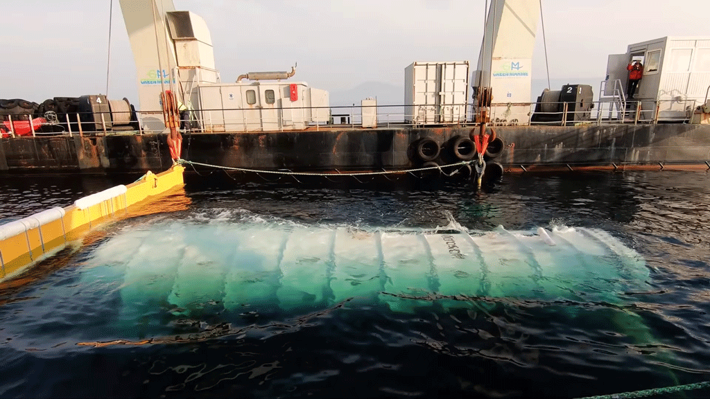
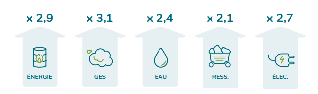

L'éco-design, l'éco-conception, le green it ou dernièrement `la conception responsable de service numérique` sont des termes qui représentent, avant tout, le fait de réfléchir à l’impact environnemental de son projet informatique et aux solutions pour le limiter ou le réduire.

"Approche méthodique qui prend en considération les aspects environnementaux du processus de conception et développement dans le but de réduire les impacts environnementaux négatifs tout au long du cycle de vie d’un produit" (Norme ISO14006 v2020)

<!--END_SUMMARY-->

Que ce soit dans une démarche écologique engagée ou à des fins de communication, le monde de l’informatique n’échappe pas à cette problématique sociétale. Comme dans tous les domaines, l’optimisation des ressources consommées se fait à tous les niveaux et sur tous les périmètres d’un projet informatique :

- Conception fonctionnelle
- Ergonomie
- Conception technique
- Conception graphique
- Développement
- Hébergement
- Contenu
…

Si certaines solutions paraissent évidentes, comme l’abonnement à une énergie verte, d’autres sont plus étonnantes, comme le fait de remplacer les boutons officiels de partage des réseaux sociaux.

Cet article n’a pas pour but de toutes les lister mais d’aborder le lien entre solution numérique et consommation de ressources et de proposer un panel représentatif de la richesse du sujet. Le but n’est pas de donner une leçon ou de sauver  le monde.

##### Le numérique, la physique avant tout.

En premier lieu, il convient de poser quelques notions pour comprendre comment des informations dématérialisées comme une page web, un email ou encore le visionnage d’une vidéo peut avoir un impact sur l’environnement.

Prenons l’exemple d’une page d’un site e-commerce.

Pour consulter cette page web, l’internaute à besoin d’un ordinateur, d’un smartphone ou d’une tablette qu’il va renouveler en moyenne tous les 2 ans. Ce terminal est connecté à une box. La fabrication de ces appareils est coûteuse en ressources environnementales puisque la production de leurs composants exige beaucoup d'énergie, des traitements chimiques et des métaux rares. 

 
[source](https://librairie.ademe.fr/cadic/2351/guide-pratique-face-cachee-numerique.pdf?modal=false){:target="_blank"}

Ensuite (de façon simplifiée) pour afficher les éléments de la page web (des photos du produit, une description, des caractéristiques, une vidéo explicative, des produits complémentaires….) : on fait appel à des informations stockées sur un serveur, celui-ci traitant la demande et renvoyant les éléments à afficher en retour. Ces informations passent par un réseau de câbles qui consomme de l’énergie, s’use, doit être remplacé ou changé pour absorber la quantité de données toujours croissante.

Chacun de ces appels nécessite de l'électricité, dont la production est responsable d’émissions de gaz à effet de serre. Plus il y a d'éléments différents, plus ces éléments sont volumineux, plus l’impact environnemental de cette page sera élevé.
Ces serveurs ont également besoin d'électricité pour fonctionner, et comme ils génèrent de la chaleur à l’usage, ils nécessitent des systèmes de refroidissement eux aussi coûteux en électricité pour fonctionner.

 
*Problématique de refroidissement des datacenters - ferme de serveurs sous marin*

Le socle du numérique et ses impacts sur l’environnement est en réalité physique ! 

Sans oublier également, le technicien qui se déplace pour la maintenance et toutes les autres dépendances et impacts que cela génère…

##### Les impacts du numérique sur l’environnement en quelques chiffres:

Le rapport de GreenIT.fr réalisé avec le soutien de l’Institut du Numérique Responsable réalisé en 2019 nous indique que le secteur du numérique représente 3,8% de l’émission des gaz à effet de serre au niveau mondial. La plus grande source d’impact environnemental du numérique est liée aux équipements des utilisateurs qui représentent 39% des émissions de gaz à effet de serre, 74% de la consommation d’eau et 76% de contribution à l’épuisement des ressources.

 
*évolution de l’empreinte environnementale de 2010 a 2025  ([source](https://www.greenit.fr/wp-content/uploads/2019/10/2019-10-GREENIT-etude_EENM-rapport-accessible.VF_.pdf){:target="_blank"})*

##### Economie d’échelle

Il nous paraît important d’expliquer le principe d’économie d’échelle avant de s’intéresser aux optimisations concrètes. 
Pourquoi ? Pour éviter le linchage populaire lorsque vous lirez qu’utiliser une simple quote au lieu d’une double fait consommer moins.

L'économie d’échelle correspond traditionnellement à la baisse d’un coût unitaire de production qui rapporté à une augmentation de la quantité produite entraîne une économie importante. 
Vous retirez une frite de chaque repas vendu en france par mcdo (1 800 000 /jour) et vous économisez de la pomme de terre à la fin de l’année !

Rapporté à notre sujet, il s'agit de diminuer la ressource consommée par chacun de vos utilisateurs pour finalement économiser une grande quantité d'énergie. Et quand on s'appelle Google, par exemple, la mise en place du dark mode entraîne des économies conséquentes.

##### En pratique

En pratique, il est possible d’agir à tous les niveaux de création et de vie d’un produit informatique : depuis sa conception fonctionnelle, graphique ou technique jusqu’à sa réalisation et sa mise en œuvre. 

Il n’est pas question ici de vous fournir une liste exhaustive d’actions à mettre en place mais plutôt d’évoquer quelques problématiques pour découvrir le sujet ou s’y sensibiliser.

<b>Compatibilité des sites web aux différents appareils et navigateurs</b> 
Au vu du rôle des équipements d’affichage dans l’impact du numérique sur l’environnement, il est primordial aujourd’hui de concevoir les sites web de façon responsive. Cela va permettre à n’importe quel utilisateur de l’utiliser de façon optimale sans avoir besoin d’un appareil en particulier. Cela permet également de limiter le poids des pages (par exemple sur la taille des images) en fonction du terminal utilisé. 
La compatibilité vers les anciens navigateurs est également à prendre en compte pour minimiser les changements d’équipement.
Les éventuels surcoûts de développement sont ici rattrapés par l’audience touchée et le confort de l’expérience utilisateur qui sera bénéfique à la conversion et donc au business.

<b>Sobriété du design et du contenu</b> 
Lorsque l’on se lance dans un projet qu’il soit professionnel ou personnel, on souhaite tous qu’il soit unique. Mais attention, à vouloir trop personnaliser on sort souvent des standards ce qui entraîne des chargements supplémentaires. Il est important de prendre en compte l’impact d’une police originale, d’une photo très haute définition ou d'éléments graphiques minutieux pour décider si l’apport au niveau UX reste intéressant.

Un site web éco-conçu est un site sobre au design épuré, sans forcément le dépouiller : il s'agit de respecter les besoins et les contraintes tout en supprimant le superflu.

<b>Sobriété des fonctionnalités</b> 
Dans une société d'abondance, les produits numériques ne font pas exception à la règle. Combien de fonctionnalités utilisez-vous réellement sur vos applications?
Il arrive vite que l’on empile les nouvelles fonctionnalités en se réjouissant de voir notre projet grandir et s'étoffer, avec l'impression d'offrir aux utilisateurs une expérience riche. Mais encore une fois l'éco conception fait réfléchir sur l’utile et le superflu. Il est important de connaître le parcours de ses utilisateurs et de retirer les fonctionnalités non utilisées pour un gain d'énergie, de performance mais aussi de lisibilité.

Diversifier son offre est intéressant mais gardez en tête de répondre aux besoins pour lesquels vos utilisateurs vous ont contacté.

<b>S'arrêter à temps: le mieux est l’ennemi du bien</b>
L’un des aspects les plus compliqué à gérer est de savoir se limiter dans l’optimisation.
L’instantanéité par exemple : elle n’est parfois pas utile et repasser sur des traitements asynchrone répondra amplement à vos besoins tout en diminuant le nombre d'échanges dans votre SI.

Une saisie assistée peut accompagner parfaitement votre utilisateur sans aller jusqu'à faire de l'autocomplétion systématique dès 3 caractères saisis.

Une redirection simple vers les réseaux sociaux est souvent suffisante et beaucoup moins consommatrice que les boutons natifs proposés par ces plateformes qui génèrent de nombreux appels.

##### Conclusion

Il existe une multitude d’actions possibles pour limiter l’impact des produits numériques. Nous pourrions passer des heures à décrire comment réduire la consommation d’énergie en passant sur du dark mode, ou en modifiant les CSS pour optimiser l’aspect d’une page pour l’impression par exemple. 
Le but de cet article était plutôt de sensibiliser au sujet, d’exposer la richesse des options possibles pour limiter l’impact environnemental de son produit en intégrant l’écoconception au sein du processus créatif.

Selon la nature du produit, énormément de choses peuvent être faites, tout dépend de votre contexte…Si le sujet vous intéresse et que vous avez envie d’aller plus loin, voici quelques liens utiles et notamment une liste des bonnes pratiques.

##### Pour aller aller plus loin

liste de bonnes pratiques: 
<https://collectif.greenit.fr/ecoconception-web/115-bonnes-pratiques-eco-conception_web.htm>

Liste d’outils utiles pour mesurer son impact: 
<https://institutnr.org/outils-ecoconception-accessibilite>

Rapport mondial sur l’impact du numérique en 2019:  
<https://www.greenit.fr/wp-content/uploads/2019/10/2019-10-GREENIT-etude_EENM-rapport-accessible.VF_.pdf> 

Impact du numérique en France :  
<https://www.greenit.fr/wp-content/uploads/2021/02/2021-01-iNum-etude-impacts-numerique-France-rapport-0.8.pdf>

Sobriété numérique, consommation usage et production:  
<https://theshiftproject.org/wp-content/uploads/2020/10/Deployer-la-sobriete-numerique_Rapport-complet_ShiftProject.pdf>
<https://medium.com/codeshake/%C3%A9coconception-8-cas-pratiques-dapplication-14032c72e8f6>

<https://ecoresponsable.numerique.gouv.fr/publications/guide-pratique-achats-numeriques-responsables/demarche-numerique-responsable/analyse-cycle-de-vie/#:~:text=L'analyse%20du%20cycle%20de,de%20services%20sur%20l'environnement>

##### Références : 
<https://librairie.ademe.fr/cadic/2351/guide-pratique-face-cachee-numerique.pdf?modal=false>
<https://www.eco-conception.fr/static/definition-de-leco-conception.html>

<https://librairie.ademe.fr/cadic/2351/guide-pratique-face-cachee-numerique.pdf?modal=false>

Impact du dark mode: 
<https://www.cnetfrance.fr/news/android-google-confirme-que-le-mode-sombre-ameliore-l-autonomie-39876317.htm>

<https://hitek.fr/actualite/le-compte-est-bon-mario-macdonalds_4002>