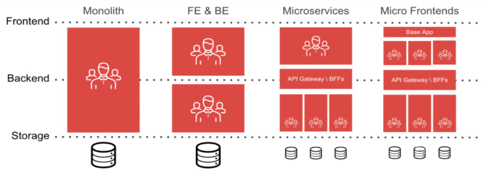
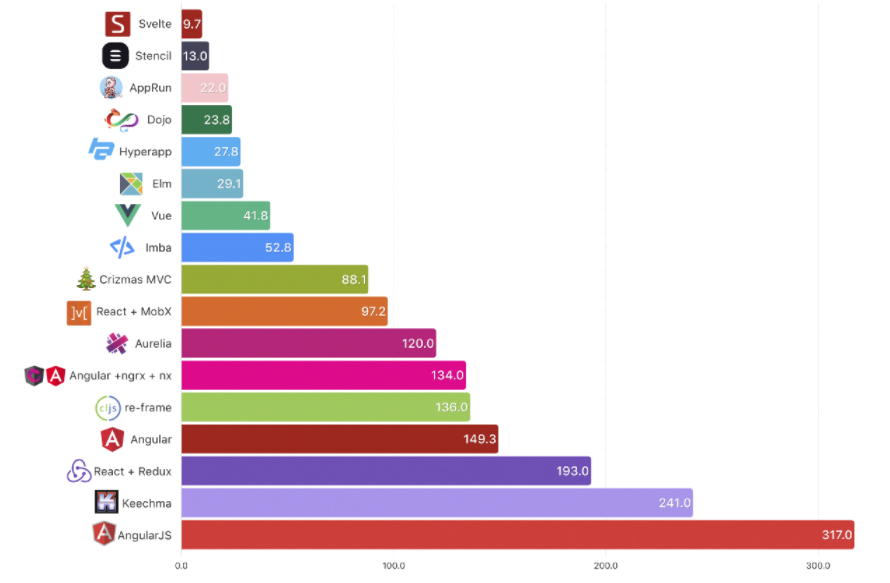
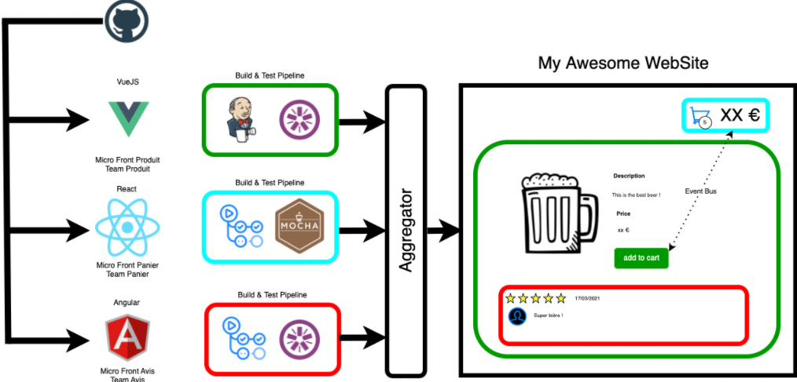

Inspiré par les architectures microservices Back-End, le principe du micro-front end se résume en une agrégation de composants web « isolées ». 
Voyez la page finale comme un puzzle où chaque morceau serait un composant MFE.
Ces composants peuvent être une barre de navigation, un bouton ou tout simplement un texte. Cette découpe apporte en quelque sorte de la "liberté". 
Ce type d’architecture permet de choisir son framework Front, d’être autonome sur sa livraison et de séparer les projets par équipes au lieu de travailler sur un monolith commun.
Le but du MFE est de simplifier la gestion, la maintenabilité, la conception et le découpage des interfaces utilisateurs. 
Garantir le bon fonctionnement de la page Web finale demandera de la rigueur et un travail commun. 
Il existe une multitude de façon de faire du micro-front end notamment en utilisant des technologies HTML (Iframe) ou un agrégateur en Back End (type Node Js, Java etc..)...
<!--END_SUMMARY-->

##### Origine

 

Le terme est apparu dans les RADAR techniques de Thoughtworks en 2016 mais c’est en 2019 que les micro-front end commencent à émerger.

#### Thoughtworks : qui sont-ils ? 

C’est un organisme public qui se concentre sur la mise en place de concept technologique. 
Ils mettent à disposition la conception et participe à la livraison de logiciels, d’outils, ils proposent également un service de conseil informatique.

#### Que s’est-il passé entre l’apparition du terme et sa réelle émergence ?

Thoughtworks a mis à disposition une recherche réalisée dans leurs équipes. Cette recherche porte sur la mise en place des micro-services au niveau de l’UI. Thoughtworks a partagé l’évolution conceptuelle des micro-front end. En Novembre 2016, arrivent les premières idées à propos de ce type d’architecture (des idées mais aussi des POC et des phases d’évaluation).  

Les ingénieurs de Thoughtworks pensent qu’il serait intéressant d’appliquer un système de micro-services au niveau de l’UI afin d’éviter les monolithes. Ils mettent en avant le fait que l’approche BFF (back-for-front : couche permettant la communication entre le back-end et le front-end) en serait largement bénéficiaire. 

S'ensuit une communication en Mai 2018 (lors de la phase d’essai), celle-ci nous informe que des équipes ont mis en place des structures monolithiques au niveau des services back. Ils font un petit rappel afin d’expliquer l’objectif des micro-front end : obtenir des composants/pages isolés et indépendants les uns des autres et qui appartiennent à différentes équipes. 

En Avril 2019 débute la phase d’émergence, à ce stade, Thoughtworks pense que la mise en place des micro-front end représente un bénéfice certain pour les équipes de développement. A partir de ce moment ils commencent à informer et à conseiller sur les implémentations liées aux micro-front end. 

#### “Et si j’ai rien compris ?”: Petit Résumé

Le processus lié à ce concept, dans un format de type release/actualisation semble venir de la frustration de certaines équipes vis-à-vis des monolithes. 

Les “assessments” donne pour définition des structures monolithiques Front : « large and sprawling browser applications that are as difficult to maintain and evolve as the monolithic server-side applications we've abandoned » 

Soit en français : « Des applications “navigateurs” volumineuses et entremêlées étant aussi difficiles à maintenir et à faire évoluer que des applications back monolithiques déjà  abandonnées. » 

#### Mise en place

##### - La Gouvernance

La gouvernance est un élément indispensable lors de l’initialisation d’un projet micro-front end. La liberté provenant de ce type d’architecture est à double tranchant. Une plus grande liberté permet de réaliser plus facilement un ensemble de tâches mais c’est aussi un moyen de surcharger votre application.

Voici 3 axes de réflexions afin de mieux comprendre la problématique : 

##### - Le premier : déterminer le scope

Réfléchissez à la taille de vos composants (comme ce qui est fait pour les briques dans un modèle microservice en back-end). Cela permet ainsi de réfléchir à la taille de vos équipes et le nombre de ressources à mobiliser. (Votre budget vous remerciera.)

##### - Le second : il en faut un pour les gouverner tous.

L’indépendance des composants peut faire perdre de vue l’objectif commun: la réalisation d’une interface graphique pour une application. Cette application a des attentes en termes d’objectifs, de performances, ou encore d’image (marketing etc…). 
Il faut, par exemple, veiller à avoir une équipe responsable du partage de la connaissance et de la culture afin de ne pas diviser “pour mieux régner” mais plutôt de “réunir pour mieux réussir”. Il est également important d’imaginer la mise en place de tests d’intégrations globaux au niveau du plus haut parent de la famille des composants. 
(Imaginez une application dont chaque composant possède sa propre charte graphique façon sapin de noël..)

Une solution commune dite “Core” se matérialise par une équipe gérant le noyau du site, elle régit les librairies de bases, la création, la gestion des outils (e.g.. Eventbus), la charte graphique etc. 
Les composants “enfants” hériteront de tout ce qui aura été prévu et partagé par le noyau applicatif.

##### - La troisième : comment bien s’équiper pour la performance ?

Il faut distinguer deux aspects lorsque l’on pense à la qualité des MFE : la performance de chacun d’entre eux mais également du site global en termes d’affichage et de rendu.
Avoir de multiples composants, c’est accepter d’avoir un possible laps de temps au moment de la création/initialisation de chacun. 
Il faut également penser au démarrage et à l'intégration de nouveaux MFE dans l’architecture globale, que ce soit en termes de cohérence, de qualité de code, de sécurité, de chaîne d’intégration et de déploiement. 
Pour éviter cela, il faut mettre en relation des experts techniques (architectes, leader, etc.) capables de trouver des solutions performantes et de partager les bonnes pratiques à tous ces différents niveaux.

<b>Point d'attention : le runtime</b> 
Plus il y a de frameworks, plus il y aura de runtimes et donc plus de risques que le poids de la page soit augmenté et sa performance dégradée. 
Il faudra limiter la diversité des frameworks utilisés. 

 

Ce graphique montre la consommation en runtime pour chaque build avec le runtime Svelte. On dénote qu’avec à peine 10 composants on consomme moins qu’un Angular pour ne citer que lui.

##### Que doit-on retenir ?

Pour résumer en un seul mot :  “Communiquez !” 
L’indépendance apportée par les MFE peut desservir, chaque équipe faisant ses composants de manière "isolée", si personne ne s’assure de la cohérence globale cela peut rapidement devenir néfaste. 
Sans communication et gouvernance, la page finale peut vite se retrouver alourdie (du au fait d’un ensemble de technologies mélangées et de la multiplicité des frameworks utilisés) ou chartée de façon bien différente et donc perdre de la cohérence (notamment via le design). 
Tous ces risques peuvent vite amener à regretter les monolithes.

<b>Schéma d’archi 

Voici un exemple qui schématise une architecture micro front avec trois MFE.
Chaque composant est développé avec une techno différente (Vue, Angular, React) et géré par une équipe spécifique, possédant ses outils de CI/CD, de tests, etc.

 

##### Framework, technos et outils

Une pluralité de frameworks qui vont vous faciliter le développement des micro frontend est disponible : chacun a sa propre philosophie dans la manière d’aborder les concepts liés aux micro frontend. 
Parmi les plus connus on peut citer Single-spa, Bit, Qiankun, Open components …

##### Pros/Cons
De grandes entreprises ont choisi de se lancer dans les micro frontend, comme IKEA sur son magasin en ligne, Spotify avec son application desktop ou encore Leroy Merlin avec son site Web et Kobi. 

Pour chacune de ces applications, des bénéfices se sont rapidement fait sentir, par exemple à travers leur vie dans les différentes plateformes, à travers l’expérience de l’utilisateur ou encore sur une meilleure réalisation des développements grâce à des équipes plus réduite mais concentrées sur une seule feature.

<b>Les avantages et inconvénients des MFE sont fortement liés.</b>

Le découpage du code
- <b>Pros</b> : plus simple, plus léger, c’est un vrai bonus de lisibilité et de maintenabilité.
- <b>Cons</b> : même si la compréhension unitaire des composants est plus simple, la complexité globale de l’application peut en revanche être plus floue.

La liberté des choix technologiques
- <b>Pros</b> : plus de technologies disponibles implique plus de possibilités.
- <b>Cons</b> : cela peut induire des problèmes de performances, de compatibilité voire de maintenabilité.

L’indépendance et l’autonomie des équipes
- <b>Pros</b> : cet aspect améliore les conditions et la qualité de développement.
- <b>Cons</b> : la relation inter-équipes ne doit pas être négligée. Le risque étant de s’éloigner de l’objectif principal, d’avoir des demandes de refontes (e.g : ne correspond pas à l’attente des composants consommateurs) et même des migrations d’outils.

L’indépendance des livraisons
- <b>Pros</b> : le choix des outils d’intégration et de déploiement continue est possible. Cela permet de livrer uniquement certaines parties de l’application.
- <b>Cons</b> : mais cela implique une gestion de la qualité, du release management ou software delivery global plus complexe à mettre en place.

Il est nécessaire de mettre en place une gouvernance forte pour garantir une cohérence dans les choix pris lors du développement des différents composants. (Objectif : assurer une qualité et maintenabilité globale).

Links : https://www.infoq.com/news/2019/04/real-world-framework-benchmark/
