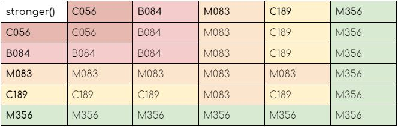

Les premiers algorithmes ont été réalisés bien avant que le premier ordinateur ne soit conceptualisé.<br/> 
Le tout premier algorithme connu a été écrit en -300 avant notre ère par Euclide (PGCD).<br/>
Aujourd’hui les mathématiques font rêver, font peur et semblent parfois inaccessibles. Une chose est sûre, elles sont partout.<br/>
Comptables, développeurs, boulangers ou même politiques, tous utilisent les mathématiques : le langage suit un ensemble de règles mathématiques.<br/>
Les structures du langage sont réalisées par l’application d’un arbre de la syntaxe abstraite.<br/>

Les structures algébriques font partie des bases des mathématiques. C’est un socle sur lequel de nombreuses règles sont construites.<br/>
En particulier, pour réaliser des applications robustes, performantes et maintenables. Elles peuvent apporter une aide précieuse.

<!--END_SUMMARY-->

#### Définition: 

Les structures algébriques sont un ensemble d’entités basées sur des axiomes initiaux à partir desquels il est possible de démontrer un certain nombre de lois.<br/>
L’objectif de ces structures est d’assurer, après avoir vérifié des axiomes simples, la déduction de lois dont il est possible de tirer des conclusions utiles.<br/>
Les premières structures à étudier, les plus simples, sont les magmas et les monoïdes.

### Les magmas

Les magmas sont les fondations des structures algébriques, le premier niveau. Ils permettent de définir le contexte.<br/>
Cependant, n’ayant que très peu de contraintes, ils ne donnent pas la possibilité d’en déduire beaucoup de lois.

<b>Recette miracle:</b><br/>
<b>Pour créer un magma, il faut réunir un ensemble et une loi de composition interne.</b>
<br/><br/>
Un ensemble est constitué d’éléments en nombre fini ou non et peut être constitué de différents types d’éléments.<br/>
Par exemple, l’univers est un ensemble contenant des sous-ensembles de planètes, d’étoiles, de trou noirs, etc.

Une loi de composition interne est une opération entre deux éléments de l’ensemble qui renvoie un élément de ce même ensemble.<br/>
L’opération consistant à mélanger deux pots de peinture crée un autre pot de peinture avec une couleur potentiellement différente.

| CH                                |
| --------------------------------- |
| C056 | B084 | M083  | C189 | M356 |

Henri a 8 ans, adore les cailloux et ses amis (Charles, Bertrand et Marie), il est aussi un spécialiste des mathématiques.

Henri possède 5 cailloux et une manière très spéciale de les nommer. Cependant Henri ne donne pas de noms aléatoires. Ses cailloux ont un nom relatif à l’endroit et au jour où ils les trouvent.<br/>
Par exemple Henri a trouvé C056 dans le jardin de son ami Charles, le 56ème jour de l’année.

CH est un sous-ensemble d’un ensemble. Il est caractérisé par la concaténation d’une lettre et d’une série de chiffres allant de 000 à 365 ; appelons cet ensemble CPH (Cailloux potentiels d’Henri).

Henri est confronté à un problème, il veut savoir quel est son caillou le plus fort. Il va donc pour cela créer une opération pour lui permettre de s’y retrouver.

Voici en quoi consiste son opération (selon ses propres mots) :

1. Calculer le poids de chaque caillou.
2. Multiplier la position dans l’alphabet de la lettre par le numéro du jour de l’année.
Comparer lequel est le plus gros, si les deux sont égalités le poids de la lettre l’emporte.

Le résultat de l’opération d’Henri a créé ce tableau :



Henri ne le sait pas mais il vient de créer un Magma sur l’ensemble CH.

<b>L’application du plus fort Caillou v0.1.0</b>
<details>
<b>Configuration requise:</b><br/>
Un magma, ne possédant aucune autre propriété que celles susmentionnées, permet deux choses essentielles.
1. Contrôler les limites des entrées 
2. Mettre en pratique une analyse séquentielle via une opération (LCI). 

Classiquement (sans savoir que c’est un magma) une simple analyse syntaxique sur une chaîne de caractère suffit :

```java
public static String stronger(List<String> cailloux){
    var inputFormat = "[A-Z]([0-2][0-9][0-9]|3([0-5][0-9]|6[0-5]))";
    ToIntFunction<String> letter = word -> word.charAt(0) - 64;
    String result = null;
    for(var aCaillou : cailloux){
        if(!aCaillou.matches(inputFormat)){
            throw new IllegalArgumentException("is not a Caillou");
        }
        if(result == null || result.trim().isEmpty()){
            result = aCaillou;
            continue;
        }
       var weightResult = (result.charAt(0) - 64) * Integer.parseInt(result.substring(1));
         var weightACaillou = (aCaillou.charAt(0) - 64) * Integer.parseInt(aCaillou.substring(1));

        if(weightResult < weightACaillou
            || (weightACaillou == weightResult &&
                letter.applyAsInt(result) < letter.applyAsInt(aCaillou))
        ){
            result = aCaillou;
        }
    }
    return result;
}
```

Ici les cailloux potentiels d’Henri ont une forme très spécifique. Voici le résultat avec un magma :

```java
record Caillou(
        char letter,
        int dayOfYear
) {
    Caillou{
        if (dayOfYear < 0 || dayOfYear > 365)
            throw new IllegalArgumentException("is not a Caillou");
        if (letter < 65 || letter > 90)
            throw new IllegalArgumentException("is not a Caillou");
    }

    int weight() {
        return ((letter - 64) * dayOfYear);
    }

    Caillou strongest(Caillou other){
        if(other.weight() > this.weight()
            || (other.weight() == this.weight()
                && other.letter > this.letter)) {
            return other;
        }
        return this;
    }

    public static Caillou stronger(Caillou a, Caillou b){
        return a.strongest(b);
    }

    public static Caillou of(String name){
        return new Caillou(name.charAt(0), Integer.parseInt(name.substring(1)));
    }
}
Optional<Caillou> henrisCaillou(List<String> inputList){
  return inputList
    .stream()
    .map(Caillou::of)
    .reduce(Caillou::stronger);
}

```
<b>Le magma permet de définir le cadre de travail :</b>
</details>
* Connaître l’ensemble des éléments sur lesquels les actions sont réalisées.
* Connaître l’opération qui sera utilisée en s’assurant que le résultat fait partie de l’ensemble
Aucune autre conclusion ne peut être déduite de ce cadre de travail. Il s’agit de structurer la pensée mais pour aller plus loin et faciliter les traitements, il est nécessaire de définir un cadre légèrement plus contraint.

Aucune autre conclusion ne peut être déduite de ce cadre de travail. Il s’agit de structurer la pensée mais pour aller plus loin et faciliter les traitements, il est nécessaire de définir un cadre légèrement plus contraint.

### Les monoïdes

Les monoïdes proviennent d’un terme allemand, mal-traduit, signifiant “Individu”.<br/>
Les monoïdes sont, comme toutes les structures algébriques, des magmas respectant des axiomes supplémentaires. Ces axiomes permettent de démontrer des propriétés qui peuvent s’avérer très utiles.

<b>Recette miracle</b>
<b>Pour créer un monoïde nous avons besoin d’un magma unifère et associatif.</b>

Unifère signifie que l’ensemble contient un élément neutre vis-à-vis de l’opération du magma. Cet élément neutre n’impacte pas le résultat si on réalise l’opération avec n’importe quel élément. `(n+0 = n et 0+m = m; 0 est un élément neutre pour l’opération '+' dans l’ensemble des entiers)`.<br/>
Associatif signifie qu’une chaîne d’opération peut être réalisée dans n’importe quel ordre sans que le résultat s’en trouve modifié. `(a+b+c = (a+b)+c = a+(b+c); la somme est associative)`.

Associatif signifie qu’une chaîne d’opération peut être réalisée dans n’importe quel ordre sans que le résultat s’en trouve modifié. `(a+b+c = (a+b)+c = a+(b+c); la somme est associative)`.

Ces deux propriétés du monoïde permettent de démontrer une loi très intéressante pour les traitements informatiques : les calculs parallèles. Sans faire la démonstration, un exemple permet de s’imaginer cette propriété en utilisant le monoïde précédemment utilisé : l’ensemble des entiers munis de la somme.

L'opération consiste à réaliser `1+2+3+4+5+6`. L’associativité permet de réaliser les opérations sous la forme `(1+2)+(3+4)+(5+6) = 3+7+11 = 10+11 = 21`. Pour réaliser les cinq opérations `(nombre de signes ‘+’)`, trois séries de calculs ont été nécessaires `(nombre de '=')` en parallélisant trois opérations dans la première étape. Cela est mathématiquement permis uniquement dans le cadre du monoïde.

### Exemple : Le Monoïde derrière le Magma d’Henri

Précédemment, Henri a créé un magma, il a également créé un monoïde sur l’ensemble CPH (Cailloux potentiels d’Henri).
Comment Henri a réussi à construire ce monoïde ?

<b>Associativité</b>
Il faut démontrer l’associativité de l'opération stronger(), visuellement sur l’ensemble CH on peut le voir (effet miroir) : 

<br/>

Il s’agit d’appliquer ces vérifications sur l’ensemble CPH. En mathématiques il est coutûme de démontrer par formulation que tout élément respecte l’associativité. Naïvement c’est possible (un élément à la fois). Cet ensemble est présent dans 2 autres ensembles : L’alphabet et les chiffres allant de 0 à 365.

Il est possible de décomposer et se placer dans un ensemble commun :

Il existe une étape intermédiaire : le calcul du poids. Le calcul du poids est un entiers allant de `0 à 9 125 (25 (Z)  * 365)` . Nous appliquons ensuite une comparaison au maximum. 
Cette étape intermédiaire se place dans un sous-ensemble d’un ensemble très connu : les entiers naturels contenant 0. De plus, l'associativité des extremums (calcul maximum et minimum) a été démontrée sur cet ensemble.

<ins>Unifère</ins>

Il faut prouver l’existence d’ un élément neutre. Selon les critères d’Henri le poids d’un cailloux est relatif à sa position dans l’alphabet puis agrégé au jour de l’année où Henri l’a trouvé (sauf exception en cas d’égalité : la lettre l’emporte). Cela veut dire que le poids minimum qui est de 0 (représenté par le cailloux potentiel d’Henri A000) est le cailloux le plus faible possible dans cet ensemble. 0 étant le nombre le plus petit des entiers naturels contenant 0, cela fait de lui un élément neutre dans le calcul du maximum :

* `Pour tout x dans N; tel que x >= 0 alors x`.

Le classement est ingénieux, à quoi peuvent servir ces axiomes ?

L’associativité permet de dire que peu importe le sens d’une opération elle aura le même résultat. Si on l’applique en première ou en dernière, rien ne change !<br/>
L’élément neutre permet de mettre en place une forme d’initialisation pour le cas où un jour Henri oublie de mettre le nom de tous ses cailloux dans son application par exemple.

Henri aimerait vraiment que son application soit plus performante car il en a encore une centaine…. de milliers de cailloux à traiter.
<br/><br/>
<b>L’application du plus fort Caillou v0.1.1</b>
<details>
L’associativité permet de mettre en place du multi-threading.<br/>
L’élément neutre a un rôle d’initialisation/valeur par défaut.


Classiquement la mise en place d’une certaine parallélisation est enclin à de nombreux doutes. Pour continuer l'exemple, il faut mettre ces doutes de côté.

```java
public static String stronger(List<String> cailloux){
    var inputFormat = "[A-Z]([0-2][0-9][0-9]|3([0-5][0-9]|6[0-5]))";
    ToIntFunction<String> letter = word -> word.charAt(0) - 64;
    AtomicReference<String> atomicResult = new AtomicReference<>("A000");
    var pool = new ForkJoinPool();

    for(var aCaillou : cailloux) {
        pool.execute(() -> {
            if(!aCaillou.matches(inputFormat)){
                throw new IllegalArgumentException("is not a Caillou");
            }
            var result = atomicResult.get();
            var weightResult = (result.charAt(0) - 64) * Integer.parseInt(result.substring(1));
            var weightACaillou = (aCaillou.charAt(0) - 64) * Integer.parseInt(aCaillou.substring(1));

            if(weightResult < weightACaillou
                    || (weightACaillou == weightResult &&
                    letter.applyAsInt(result) < letter.applyAsInt(aCaillou))
            ){
                atomicResult.set(aCaillou);
            }
        });
    }
    return atomicResult.get();
}
```

```
Result : Y364
Time: 78 ms over 250000 iterations ; CPU usage (%): 4.438960808734625 %
```

```
Avant : Y364
Time: 235 ms over 250000 iterations ; CPU usage (%): 4.438960808734625 %
```

Voici le résultat avec la réflexion sur les monoïdes :

```java
record Caillou :
….
public static Caillou neutral(){
    return new Caillou('A', 0);
}
….
Optional<Caillou> henrisCailloux(List<String> inputList){
  return inputList
    .parallelStream()
    .map(Caillou::of)
    .reduce(Caillou.neutral(), Caillou::stronger);
}
```

```
Result: Optional[Caillou[letter=Y, dayOfYear=364]]
Time: 8 ms over 250000 iterations ; CPU usage (%): 4.438960808734625 %
```

```
Avant : Optional[Caillou[letter=Y, dayOfYear=364]]
Time: 12 ms over 250000 iterations ; CPU usage (%): 4.438960808734625 %
```
</details>

<br/><br/>
Le monoïde permet d’apporter de nouvelles propriétés utiles pour une meilleure conception :
* Une chaîne d’opération peut être parallélisée en garantissant le résultat
* Une valeur par défaut peut être utilisée pour éviter les erreurs de traitement
Cette structure est la première à apporter des propriétés utiles aux conceptions en informatique. Il en existe beaucoup d’autres, plus ou moins complexes à identifier, pour obtenir divers avantages. Ainsi, en vérifiant des propriétés sur un ensemble et une opération, il est possible de déduire de nombreuses lois qui facilitent ou optimisent les traitements.

### Ce qu’on doit en retenir

Bien sûr il ne faut pas forcément coder comme un grand mathématicien avec son tableau rempli de formule (quoique en dehors des formules ?).<br/>
Comme l’a dit un grand sage “apprendre à coder via des structures et seulement des structures est un comportement élitiste”.<br/>
Ce même grand sage a dit qu’il est préférable d’apprendre à les identifier.<br/>
Identifier leurs forces, leurs faiblesses, le contexte le plus adéquat à leur utilisation. Une fois qu’on arrive à les cerner, une porte s’ouvre vers une autre manière de développer des applications qualitatives.<br/>
La multitude de structures algébriques qui existent n’est pas exposée ici. Nous vous avons fait vivre les aventures d’Henri pour ouvrir une perspective sur ce monde et dans l’espoir que vous puissiez vous y faire votre propre avis.<br/>
Sans les mathématiques, tout est faisable, mais avec les mathématiques, tout est structuré.


### Sources :

* https://blog.derniercri.io/observons-une-premiere-structure-algebrique-appliquee-a-linformatique-le-monoide/
* https://fr.wikipedia.org/wiki/Th%C3%A9orie_des_cat%C3%A9gories#Morphismes - Xavier Van de Woestyne
* Thomas Haesslé - Cours et discussions (https://oteku.github.io/)
* Lambda Lille - conférences (https://twitter.com/lambdalille)
* https://www.youtube.com/watch?v=RaqlxOihGxw&list=PLNefH6S6myiMFlgsEIGHb8KZaLKE2eAZQ - micmaths
* https://fr.wikipedia.org/wiki/Th%C3%A9orie_des_cat%C3%A9gories#Morphismes
* https://fr.wikipedia.org/wiki/Structure_alg%C3%A9brique
