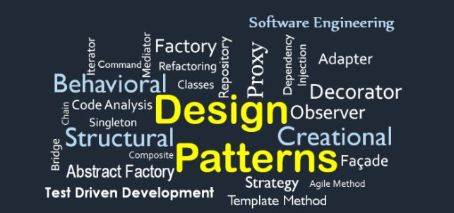
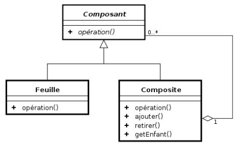
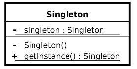
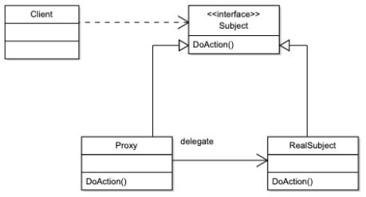
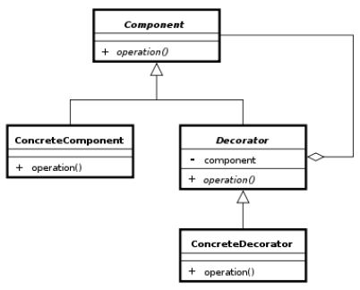
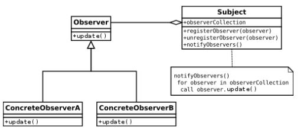
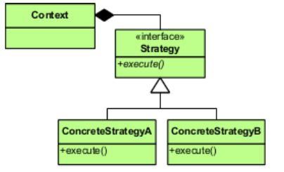

##### L’art de savoir utiliser le bon outil au bon moment<br/>

<br/>

Les “Design Patterns”, ou “patrons de conception”, sont un ensemble de solutions reconnues, particulièrement dans la programmation orientée objet, comme étant la meilleure réponse afin de résoudre un problème de conception récurrent.

Les exemples de patrons peuvent être faits de différentes façons: par le biais de schémas, de pseudo code, la manière d’organiser ses modules ou classes ou à l'aide d'une implémentation proposée.

<!--END_SUMMARY-->

## D'où viennent-ils ? 

Nous pouvons être redevable à Christopher Alexander, anthropologue et architecte Américain pour avoir travaillé sur “la théorie des Pattern Languages” permettant des déclinaisons dans des domaines aussi divers que l’histoire de l'art, l'anthropologie…<br/>
Cette façon d’aborder le modèle de conception a été reprise en 1987 par Kent Beck (concepteur d'extrême programming) et Ward Cunningham (inventeur du concept de Wiki) , qui ont décidé d’appliquer ce type de design architectural à l’informatique.<br/>
C’est en 1994, à la suite d’un livre nommé <b>Design Patterns: Elements of Reusable Software</b> co-écrit par un collectif (GoF pour Gang of Four) et décrivant plus d’une vingtaine de patrons que ce principe fut réellement reconnu.

## Voici les différents types de patrons de conception :

### <b>Le patron de création</b> (Creational Pattern)<br/>
Il a pour but d’aider à résoudre les problèmes d’instanciation de classes.

Quelques exemples:<br/>
* Singleton
* Prototype
* Fabrique (Factory)
* Fabrique Abstraite (Abstract Factory)
* Monteur (Builder)

### <b>Le patron de structure</b> (Structural Pattern)
Structurer les classes et objets afin de garder ceux-ci flexibles et efficaces au travers de leur 
structuration et leur interface.

Quelques exemples:<br/>
* Pont (Bridge)
* Façade
* Adaptateur (Adapter)
* Objet composite
* Proxy
* Poids-mouche (Flyweight pattern)
* Décorateur (Decorator)

### <b>Le patron de comportement</b> (Behavioral Pattern)
Permet de modéliser et répartir les responsabilités entre les objets.

Quelques exemples:<br/>
* Chaîne de responsabilité (Chain of Responsibility)
* Commande (Command)
* Interpréteur (Interpreter)
* Itérateur (Iterator)
* Médiateur (Mediator)
* Mémento
* Observateur (Observer)
* Etat (State)
* Stratégie (Strategy)
* Patron de méthode (Template Method Pattern)
* Visiteur (Visitor)

## Quand et pourquoi les utiliser ?

Un développeur ayant une culture du Design Pattern (et sachant quand c’est le moment d’en utiliser un) pourra trouver plus rapidement une solution grâce aux différents paradigmes proposés et ayant déjà fait leurs preuves.

Il permet donc : 
* d’accélérer le processus de développement, 
* de réduire les bugs potentiels, 
* de connaître les bonnes pratiques et les pièges à éviter 
* de s’appuyer sur la capitalisation de l’expérience de la communauté.

Il est donc vraiment important de l'intégrer le plus tôt possible dans le processus de conception / développement.<br/>
Un bon développeur devra savoir s’arrêter et remettre en question son code lorsqu'il se retrouve face à un problème.<br/>
Il faudra se demander “Ne suis-je pas en train de réinventer la roue ? N'existe t’il pas un patron qui pourrait répondre à ma problématique ?”

### Quelques exemples

Il existe de nombreux modèles qui sont souvent très utilisés. La plupart du temps beaucoup de développeurs en utilisent sans savoir qu’il s’agit de modèles de patrons de conception.
Voici quelques cas parmis ceux que vous utilisez peut-être sans même le savoir.

Le <b>Modèle Composite</b> : pour représenter des structures arborescentes pour présenter des hiérarchies de composants / composés.

<br/>

Le <b>Singleton</b> qui permet de limiter l’instanciation d’une classe à un seul objet.

<br/>

Les <b>itérateurs</b> qui permettent de parcourir les éléments d’une collection (liste, arbre etc.).

Le <b>Proxy</b> : substitue une classe à une autre en utilisant la même interface permettant entre autres la sécurité ou l’appel de méthodes à distance.

<br/>

Le <b>Décorateur</b> : attacher dynamiquement des nouvelles responsabilités à un objet 

<br/>

Le <b>Façade</b> pour simplifier l’utilisation d’une interface complète.

L’<b>Observateur</b> : mécanisme de souscription afin d’envoyer des notifications à plusieurs objets qui sont observés.

<br/>

Le <b>Stratégie</b> qui permet de créer des algorithmes séparés dans plusieurs classes autonomes / interchangeables. 

<br/>

Voici un cas d’usage écrit en Typescript pour savoir quand l'utiliser. Imaginons que l’on souhaite faire plusieurs actions différentes mais avec le même objet, nous pourrions être tenté de faire une classe qui contiendrait toutes ces actions? Oui et non, car celà reviendrait à ne pas respecter un des principes du [SOLID](https://fr.wikipedia.org/wiki/SOLID_(informatique)) à savoir le “S” pour Single Responsibility Principe.
Prenons le cas d’un site, nous voulons développer une classe qui permet de gérer le paiement.

```typescript
Interface PaymentStrategy {
    public doPay(amount: number): void;
}
```

nous allons ensuite créer plusieurs classes correspondant aux différents moyens de paiement : 

```typescript
class CreditCardStrategy implements PaymentStrategy {

    //  ici on fait des traitements différents

    public doPay(total: number): void {
        console.log('je paye en carte de crédit un total de', total);
    }		
}
```

```typescript
class OtherPaymentStrategy implements PaymentStrategy {


    //  ici on fait des traitements différents

    public doPay(total: number): void {
		console.log('je paye en X moyen de paiement un total de', total);
	}		
}
```

Pour finir nous créerons une classe finale qui va permettre d’utiliser notre stratégie.

```typescript
class Cart {

	private total: number;

	constructor(total: number){
		this.total = total;
	}
	
	public getTotalCart(): number {
		return this.total;
	}

	public doPay(PaymentStrategyMethod methodToPay): void {
		methodToPay.doPay(this.getTotalCart());
	}
}
```

Afin d’utiliser tout ça on pourrait imaginer un sélecteur lorsque l’on passe à l’étape du paiement qui permettrait de sélectionner son moyen de paiement préféré.


exemple : 

```typescript
cart = new Cart(199);
cart.doPay(new CreditCardStrategy()); // pour le premier cas
cart.doPay(new OtherPaymentStrategy()); // pour le second cas
```


Le <b>Prototype</b> qui permet de créer de nouveaux objets à partir d’objets existants tout en laissant à la classe le soin du type d’objet à créer.

La <b>Fabrique</b> pour instancier des objets dans une classe mère tout en laissant aux sous classes le choix des types d’objets à créer.

L' <b>Object Pool</b> pour économiser le temps d’instanciation et de suppression lorsque de nombreux objets ayant une vie courte seront utilisés.

## Pour finir 

Vous l’aurez compris, le Design Pattern fait partie intégrante des outils indispensables du développeur.<br/> 
Le but de cet article est de vous donner l’envie de vous y intéresser, de lire, de découvrir et surtout d’apprendre à savoir quand les utiliser afin de répondre au mieux à vos besoins.

Attention toutefois à ne pas tomber dans l’exact contraire, à savoir, l’anti pattern.<br/>
Cela reviendrait à faire le mauvais choix et donc à apporter la mauvaise réponse à une problématique donnée.

Voici un exemple développé en Java par Maxime, il combine le Pattern Observer et Builder avec comme thème l’organisation de course à pied. <br/>
Lien du repos git : https://github.com/ekit3/design-pattern

Sources ayant servie à écrire l'article et pour aller plus loin : 

https://fr.wikibooks.org/wiki/Patrons_de_conception
https://ryax.tech/fr/design-pattern-cest-quoi-et-pourquoi-lutiliser/
https://refactoring.guru/
https://madasamy.medium.com/introduction-to-object-oriented-design-patterns-part-i-4e5c7845015b
