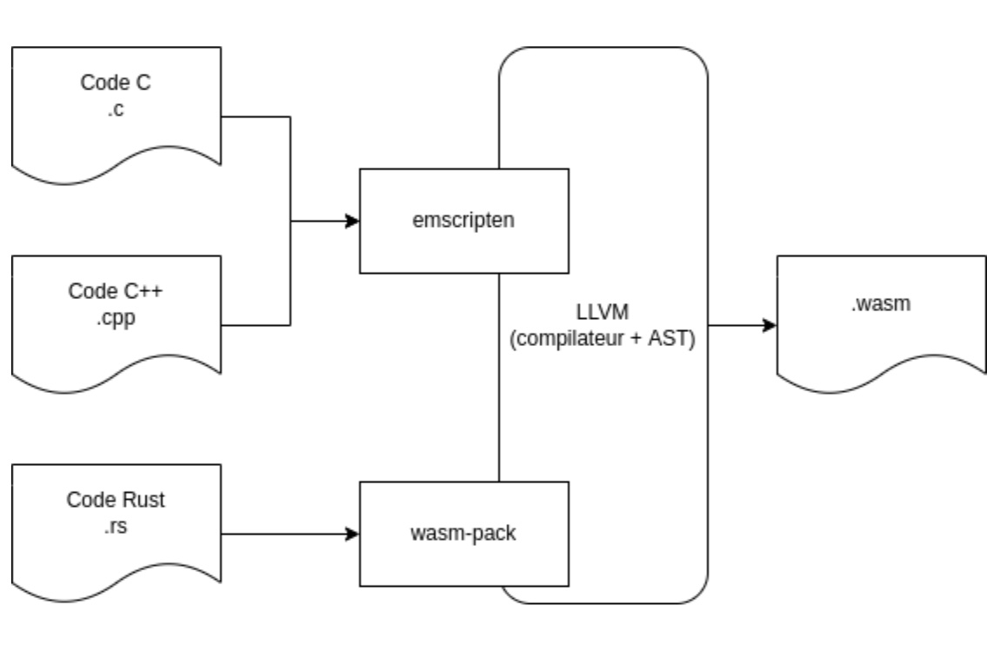
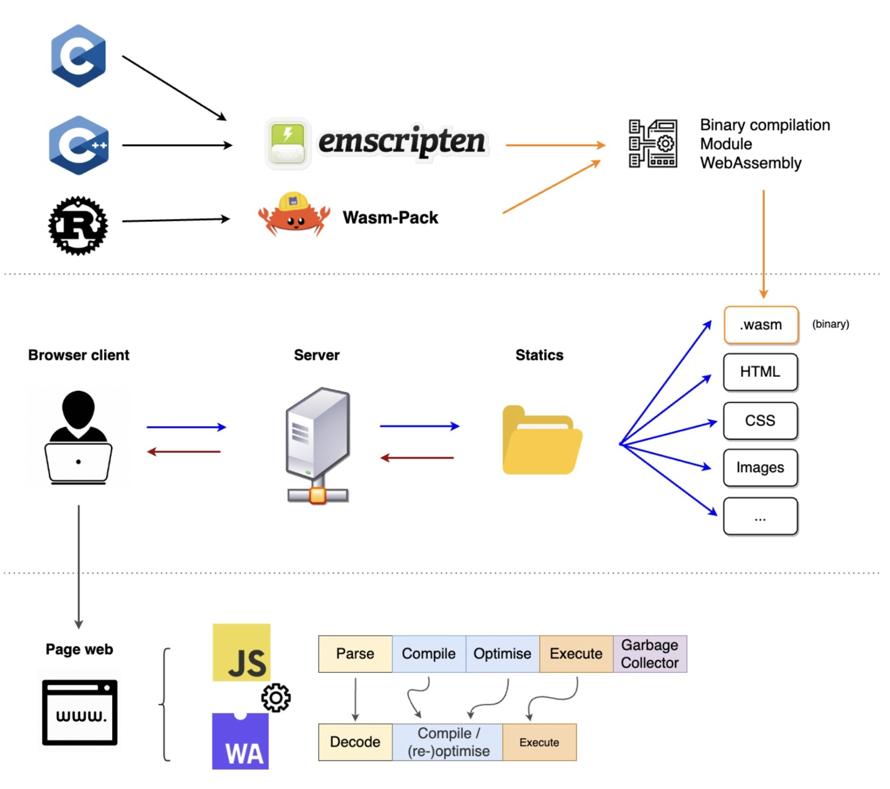
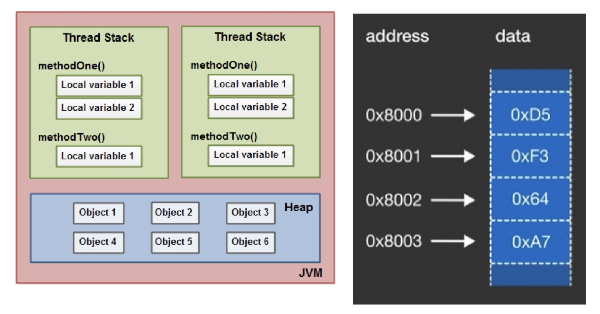

##### Boostez vos applis web avec Web Assembly !  

Web Assembly (ou WASM) est un standard du World Wide Web consistant en un [bytecode](#bytecode) exécuté côté navigateur dans un environnement dédié (sandbox) en complément du Javascript (JS).

Ce code bas niveau étant interprété côté navigateur peut être écrit dans différents langages comme le C, C++, RUST, x86 etc. 

L’interprétation du Web Assembly se fait plus bas-niveau que celle du Javascript. Web Assembly utilise de manière plus efficace et directe les ressources disponibles sur la machine sur laquelle il s’exécute (CPU/Mémoire), et permet donc d’atteindre un haut niveau de performances. 

Ces performances accrues permettent alors de développer des applications qui n’étaient pas envisageables en Javascript. Par exemple du traitement vidéo en temps réel, comme le floutage d’arrière plan en visio-conférence, ou encore des jeux vidéo. 

Pour résumer, WASM a été créé pour tirer parti de la puissance des langages de bas niveau, couplé à la flexibilité de Javascript afin de créer des applications Web plus performantes.

<!--END_SUMMARY-->

## Un peu de contexte

WASM fut officiellement lancé en 2015 pour la première fois sous forme d'une démonstration faite sous Unity (moteur de jeu multi plateforme) afin de démontrer les performances et les possibilités de l’outil.

Mozilla a sorti asm.js, le 21 mars 2013, un sous-ensemble du langage JS pour améliorer les performances grâce à une couche de traitement binaire. 
Google et Lars Bak ont mis en place un moteur JS V8, le 2 septembre 2008, qui peut compiler nativement vers de l’assembleur.
Ces deux derniers événements sont surtout des améliorations liées à la gestion du langage.

## Objectifs 

Les objectifs du WASM sont:
 
* <b>la rapidité</b> : avoir des performances proches des applications natives (C/C++/Rust) tout en fonctionnant sur un navigateur Web..
* <b>la portabilité</b> : WebAssembly est conçu de manière à s'associer aux autres technologies web mais aussi de garantir une rétro compatibilité ascendante entre les différentes versions. 
Il existe aussi des polyfills pour les navigateurs plus anciens.
* <b>la sécurité</b> : l'environnement dédié permet de garantir une isolation totale du code et de la machine de l’utilisateur.
Par exemple, la partie entrée / sortie (réseau et fichier) est totalement inaccessible (en dehors du module qui l’embarque).

## La compilation 

 

Fig: Le processus de compilation Web Assembly   
 
Afin d'exécuter du Web Assembly dans une page web, il faut compiler du code écrit dans un langage source (écrit en C, C++, Rust ou autre) vers un code intermédiaire (le bytecode WASM). Le bytecode est situé entre le code d’un langage source et le code machine (binaire).
Cela est rendu possible grâce à une infrastructure de compilation [LLVM](#llvm), qui implémente la traduction d’un AST ([arbre de syntaxe abstraite](#syntaxeTree)) en bytecode WASM.  
Le fichier ainsi compilé aura pour extension ‘.wasm’.

L’utilisation d’une LLVM permet d’isoler et d’uniformiser la compilation de tous les langages sources supportés vers ce format. Pour ajouter le support d’un langage, il suffit d’implémenter un programme capable de lire un AST pour le transmettre à la LLVM (transpilateur). 
Il est donc possible de créer des compilateurs pour n’importe quel langage. (une liste des langages principaux déjà supportés par WASM se trouve sur le Discord de sa communauté.)
 
Fonctionnement général du Web Assembly

 

Le code initialement écrit dans un langage haut-niveau est donc compilé dans en un module web-assembly. La compilation produit un fichier binaire ‘.wasm’ contenant le bytecode devant être exécuté dans le navigateur web de l’utilisateur. Les fichiers ‘.wasm’ peuvent alors être distribués aux utilisateurs comme le reste des ressources statiques d’une application web.

Lorsqu’un utilisateur consulte l’application web, les ressources statiques (HTML, CSS, Images) sont téléchargées par son navigateur, ainsi que le code Javascript et les binaires ‘.wasm’. Le navigateur se charge de décoder, compiler et exécuter le code WASM, en parallèle du code Javascript habituel.

## Les concepts 

* Intégration sur le web
WebAssembly est conçu de manière à facilement s'associer aux autres technologies web et de garantir une rétrocompatibilité.
* Le fichier compilé est téléchargé, l'exécution est faite nativement sur le poste de l’utilisateur et la mémoire est gérée de manière linéaire.
* Bien que l'exécution ait lieu sur le poste de l’utilisateur, WASM ne permet pas l’accès à certains composants du [kernel](#kernel) : Il existe une limite sur la gestion des entrées/sorties. (pour des raisons de sécurité)

* Mémoire linéaire
La mémoire linéaire est une seule plage d’adresse mémoire sur laquelle on peut agir au fil de l’eau. Vu l’abstraction du sujet, il est mieux de pouvoir se représenter tout ça. Voici un parallèle entre la manière dont est gérée la mémoire en Java (de Jakob Jenkov) et un schéma de la mémoire linéaire (de Meghalee Goswami) :

 

Avant d’aller à la suite un petit aparté : WASM a mis en place un traducteur du fichier compilé nommé [Web Assembly Text (WAT)](https://developer.mozilla.org/en-US/docs/WebAssembly/Understanding_the_text_format). Le fichier compilé est donc lisible

* Module 
Représente un binaire WASM qui a été compilé en code exécutable par le navigateur. 
* Table 
Représente un tableau typé de référence ne pouvant être stocké de manière brute en mémoire (pour des raisons de sécurité et de portabilité).
* Instance
Représente un module associé ainsi que ses états (la mémoire, la table ainsi qu’un ensemble de données importées). 

## Les cas d’usage de WASM

Comme expliqué en introduction, WASM permet un haut niveau de performances impossible en Javascript. Ces performances ouvrent la possibilité d’implémenter de nouveaux cas d’usage. Certains de ces cas d’usage sont concrets et déjà mis en place dans certaines applications et jeux. D’autres cas d’usage sont plutôt de l’ordre du POC (Proof Of Concept) ou de la démo :  
* Server-side rendering
* OCI (Open Container Initiative) *
* 3D Web View Rendering
* Étendre des fonctions JS 
* Extensions navigateurs (ublock origin)
* Utilisation de la 3D

Voici des exemples d’applications connues faites à l’aide de WASM :  
[Figma](https://www.figma.com/fr/blog/webassembly-cut-figmas-load-time-by-3x/), [Google Earth](https://madewithwebassembly.com/showcase/google-earth), [Unity](https://madewithwebassembly.com/showcase/unity), [Unity](https://madewithwebassembly.com/showcase/tensorflow), etc. 

### Pros 
* Performance
* Cross platform
* Sécurisation
* multiples langages Rust / C++ / C etc.
* Portabilité

### Cons 
* Communauté faible
* Beaucoups de concepts complexe à appréhender avant de pouvoir faire la moindre chose
* N’a pas encore percé malgré son "âge"
* Installation plus ou moins aisée en fonction de la plateforme de développement
* Pas “user friendly"

## Conclusion

Le principal but de WASM est d’apporter un enrichissement de la stack technique de Javascript avec un haut niveau de performances.
La plus grande difficulté de WASM reste d'assimiler ses différents principes et concepts généraux 
* devoir utiliser un langage de bas niveau
* utiliser un compilateur
* avoir affaire à une communauté de niche
* assez complexe à appréhender
Malgré une adoption encore faible, il n’en reste pas moins fiable que ce soit en termes de sécurité, de performance, de lisibilité et dans certains domaines la seule solution possible afin de garantir un haut niveau de performance sur une application Web.

## Lexique

* <b><a name="bytecode">bytecode:</a></b> En informatique, le bytecode (terme anglais signifiant « code en bytes ») est un code intermédiaire entre les instructions machines et le code source, qui n'est pas directement exécutable. Le bytecode (également appelé code portable ou p-code) peut être créé à la volée et résider en mémoire (compilation à la volée, JIT en anglais) ou bien résider dans un fichier, généralement binaire qui représente le programme, tout comme un fichier de code objet produit par un compilateur.
[Source](https://fr.wikipedia.org/wiki/Bytecode)

* <b><a name="syntaxeTree">Arbre de syntaxe abstraite:<a></b> Un arbre de syntaxe abstraite (AST) est une manière de représenter la syntaxe d'un langage de programmation sous la forme d'une structure arborescente hiérarchique. Cette structure est utilisée pour générer des tables de symboles pour les compilateurs et la génération de code ultérieure. L'arbre représente toutes les constructions du langage et leurs règles ultérieures.
[Source](https://definir-tech.com/arbre-de-syntaxe-abstraite-ast/)

* <b><a name="llvm">LLVM:</a></b> LLVM (anciennement appelé Low Level Virtual Machine en français : « machine virtuelle de bas niveau ») est une infrastructure de compilateur conçue pour l'optimisation du code à la compilation, à l'édition de liens, voire à l'exécution ou durant les « temps morts » d'un programme, quel que soit le langage d'origine.
LLVM permet de créer une machine virtuelle pour des langages similaires à Java et sa JVM, un générateur de code pour une architecture matérielle spécifique, et des optimiseurs de compilation indépendants de toute plate-forme et de tout langage.
[Source](https://fr.wikipedia.org/wiki/LLVM)

* <b><a name="kernel">Kernel:</a></b> terme anglais signifiant « noyau ». Il constitue le cœur du système qui exploite un ordinateur. Il établit la communication entre la partie matérielle et la partie logicielle de l'appareil.
[Source](https://www.jedha.co/blog/kernel-definition-utilite )

## Sources 

The state of WebAssembly (2022)
* [https://tech.mozfr.org/post/2017/03/08/D-ou-vient-la-rapidite-de-WebAssembly](https://tech.mozfr.org/post/2017/03/08/D-ou-vient-la-rapidite-de-WebAssembly)
* [https://developer.mozilla.org/fr/docs/](https://developer.mozilla.org/fr/docs/)
* [https://emscripten.org/](https://emscripten.org/)
* [https://developer.mozilla.org/fr/docs/](https://developer.mozilla.org/fr/docs/)
* [https://jenkov.com/tutorials/java-concurrency/java-memory-model.html](https://jenkov.com/tutorials/java-concurrency/java-memory-model.html)
* [Angry Bots Démo](https://www.youtube.com/watch?v=hSeB9I_mK6A&t=4s)

Pour aller plus loin :
3 Big Projects That Are Already Embracing WebAssembly
focus à faire sur extension navigateur ublock et son bench
* [lien discord](https://discord.gg/3B8QFXkYTc)
* [Applications faite en WASM](https://madewithwebassembly.com/)
* [OCI (Open Container Initiative)](https://radu-matei.com/blog/wasm-to-oci/)
* [schéma mémoire linéaire de Meghalee Goswami](https://study.com/academy/lesson/what-is-the-linear-memory-model-definition-constraints.html)